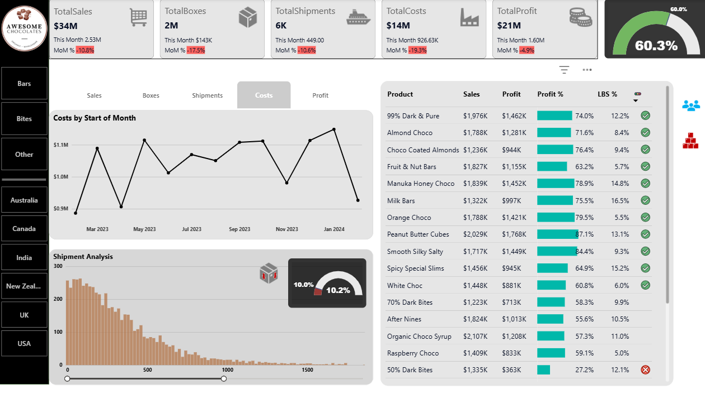

# Sales-Dashboard
Sales dashboard for a chocolate company
See full dashboard here -[App PowerBI link](https://app.powerbi.com/view?r=eyJrIjoiNWJiNDQ4YTQtNWIxNi00NmE5LTk1MWEtNmNkZGUyM2U4ZmEwIiwidCI6IjUzNTA4ZDUyLWQxYjAtNDliMC1iNGJhLTM1MzNjMTI0OWEwMSJ9)

Awesome Chocolates Sales Dashboard
This project showcases a Sales Performance Dashboard for a fictional company, Awesome Chocolates, built using Power BI and Excel.

Project Overview
This dashboard helps visualize and analyze the sales performance of Awesome Chocolates across regions, products, and time periods. It is designed to support data-driven decision-making by providing insights into:

Monthly sales trends

Product category performance

Regional performance breakdown

Key performance indicators (KPIs)

MoM % changes in Sales, Profit, and Cost using DAX

🛠 Tools & Technologies
Power BI Desktop

Excel (used as the data source)

DAX (for calculated measures and KPIs)

Power Query (for data transformation and cleanup)

Tabular Editor (used for Calculation Groups - optional)

📈 Key Features
Dynamic Time Intelligence: Month-over-Month (MoM) % change calculated using a DAX-based calculation group

Interactive Filters: Allow users to drill down by product, region, and date

Clean and Responsive Layout: Designed for clarity and usability

Custom Measures: Sales, Profit, Cost, MoM % change, and YoY comparisons

Data Cleansing: Handled via Power Query to ensure accuracy and consistency

🎯 Purpose
This project was created for learning and portfolio purposes. It demonstrates practical use of Power BI, DAX, and Power Query for sales analytics in a real-world scenario.
